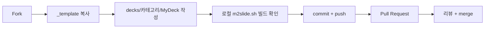

# 기여 가이드

m2slide-deck 은 **Pull Request 기반** 협업 저장소입니다. 아래 흐름을 따라 주세요.

## 기본 흐름

## 규칙

1. **위치**: 새 덱은 반드시 `decks/<카테고리>/<덱이름>/` 아래에 둡니다. 카테고리가 없으면 `misc/` 사용 또는 PR 에서 신규 카테고리 제안.
2. **덱 이름**: PascalCase 권장 (예: `KubernetesIntro`). 공백·특수문자 금지.
3. **필수 파일**: 각 덱 폴더에 `README.md`(제목·저자·요약)와 `markdown/` 슬라이드 소스를 포함합니다.
4. **소스만 커밋**: 빌드 산출물(`slide/`, `*.epub`, `*.pdf`)은 `.gitignore` 처리됩니다. 커밋하지 마세요 — 각자 `m2slide.sh` 로 재빌드합니다.
5. **이미지**: `img/` 에 두고 마크다운에서 `./img/...` 상대 경로로 참조.
6. **빌드 확인**: PR 전에 로컬에서 `./m2slide.sh <덱경로>` 가 성공하는지 확인.

## m2slide 마크다운 규칙

슬라이드 작성 규칙은 m2slide 본체 문서를 따릅니다.

* 슬라이드 도구 공통: `md-slide-rules`
* m2slide 특화(`#layout-*`, `::: slot`, AGENDA.md 등): m2slide 저장소의 `md-m2slide-rules`

## 리뷰 기준

* 빌드가 통과하는가
* 덱 폴더에 `README.md` 가 있고 저자·요약이 명시됐는가
* 소스만 커밋됐는가 (빌드 산출물 미포함)
