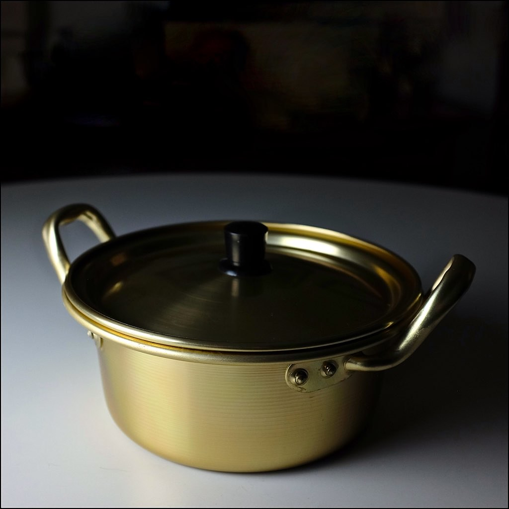
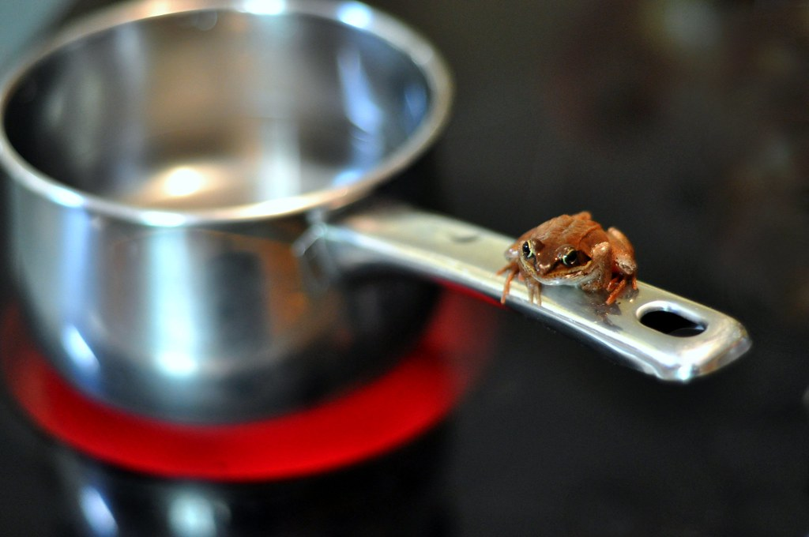

## 준비물

::: columns
::: {.column width="52%"}
::: cards
* **:fa-carrot: 재료**
  - 라면 한 봉지
  - 물 오백오십 밀리리터
  - 계란 한 개 (선택)
  - 대파·청양고추 (선택)
* **:fa-kitchen-set: 도구**
  - 작은 냄비
  - 젓가락
  - 타이머 (휴대폰)
:::
:::
::: {.column width="48%"}

:::
:::

::: source
이미지: The Marmot, CC BY 2.0 (Flickr)
:::

---

## 전체 흐름

::: htmlart process
* 물 550ml 끓이기
* 스프 먼저 투입
* 면 투입·타이머 시작
* 4분 30초 가열
* 계란·고명 추가
* 불 끄고 담기
:::

* 물 → 스프 → 면 → 시간 → 고명 → 완성
* 각 단계의 **순서**가 맛을 좌우함

---

## 1단계 · 물 끓이기

::: columns
::: {.column width="55%"}
* 냄비에 물 **오백오십 밀리리터**를 넣고 센 불로 끓임
* 계량이 어려우면 종이컵 약 세 컵 반이 기준
* 큰 기포가 올라올 때까지 충분히 끓임

> 물이 덜 끓은 상태에서 면을 넣으면 면이 불어 식감이 떨어짐
:::
::: {.column width="45%"}

:::
:::

::: source
이미지: jronaldlee, CC BY 2.0 (Flickr)
:::

---

## 2단계 · 스프 먼저

::: columns
::: {.column width="50%"}
* 물이 끓으면 **스프를 먼저** 넣음
* 끓는점이 올라가 면이 더 쫄깃하게 익음
* 분말 스프 → 건더기 스프 순서
:::
::: {.column width="50%"}
* 매운맛은 이때 스프 양으로 조절
* 국물을 진하게 원하면 물을 조금 줄임
* 물이 다시 끓어오르면 다음 단계로
:::
:::

---

## 3단계 · 면과 시간

::: htmlart timeline
* 0초 · 면 투입
* 2분 · 중간 젓기
* 4분 30초 · 완성
* 5분 · 푹 익힘
:::

* 면을 넣는 순간 타이머 시작 — **4분 30초**가 기준
* 젓가락으로 들었다 놓으며 공기와 접촉시키면 더 탱탱해짐

---

## 4단계 · 고명과 마무리

::: cards
* **:fa-egg: 계란**
  - 풀어 넣으면 국물이 부드러워짐
  - 반숙은 완성 30초 전 투입
* **:fa-pepper-hot: 대파·고추**
  - 마지막에 넣어 향과 색을 살림
* **:fa-cheese: 치즈·김치**
  - 취향껏 추가해 변주
:::

---

## 실패하지 않는 3원칙

::: htmlart pyramid
* 시간 엄수 — 4분 30초
* 투입 순서 — 스프 먼저
* 물의 양 — 550ml
:::

* 아래에서 위로 쌓이는 세 가지 기본
* 셋만 지키면 언제나 같은 맛

---

## 완성

::: columns
::: {.column width="50%"}
**마무리**

* 불을 끄고 바로 그릇에 담아 냄새를 살림
* 국물부터 한 입 — 오늘의 한 그릇 완성
* 같은 순서를 반복하면 언제나 같은 맛
:::
::: {.column width="50%"}
**더 맛있게**

* 김치·단무지 곁들이기
* 찬밥 한 공기로 마무리
* 뜨거울 때 바로 먹기
:::
:::

> 물 550ml · 스프 먼저 · 4분 30초 — 이 세 가지면 실패 없음

---

## 라면, 한 그릇의 철학

::: cards
* **:fa-clock: "면발은 기다려주지 않는다"**
  - 3분의 미학 — 타이밍이 곧 맛
* **:fa-bowl-food: "국물이 답이다"**
  - 스프 반, 정성 반
* **:fa-users: "라면 앞에서는 모두가 평등하다"**
  - 새벽 두 시의 위로 한 젓가락
* **:fa-heart: "한 젓가락의 위로"**
  - 누구에게나 공평한 한 그릇
:::

> **잘 끓인 라면 한 그릇이면, 오늘 하루도 충분하다** 🍜
>
> 물 550ml · 스프 먼저 · 4분 30초 — 이 세 가지면 실패 없음
